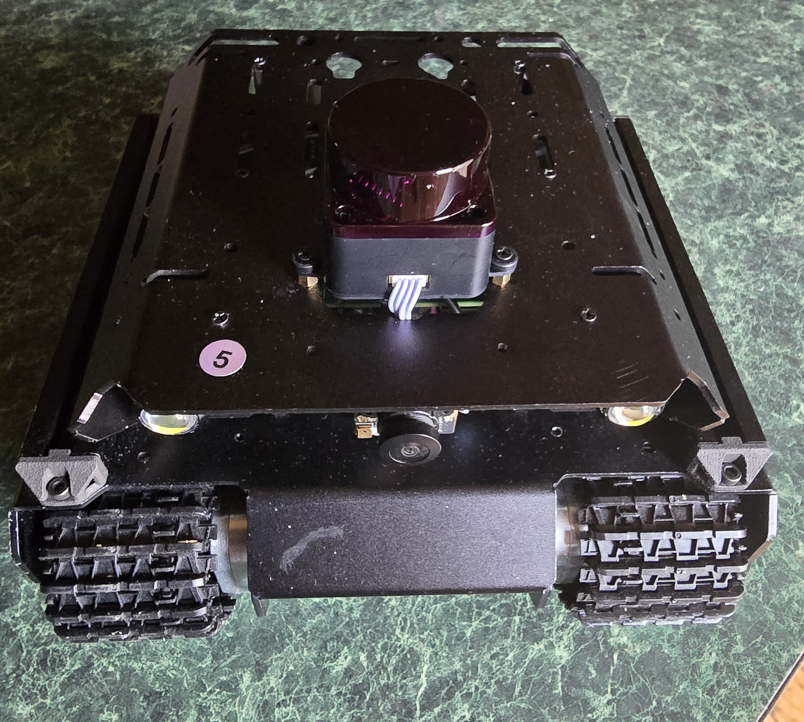

# Don's UGV Beast

My ROS2 Jazzy-based autonomous robot built on the Waveshare UGV Beast platform with custom modular packages.



## 🤖 Features

- **Voice-Activated Search Assistant**: Say "Hey Beast" to activate, ask any question, and get spoken answers from web search
- **Dual Microphone Support**: Camera mic (primary) and sound board mic
- **Hybrid Architecture**: Local wake word detection + cloud-based speech recognition and search
- **Safety Features**: LiDAR-based obstacle detection with audio warnings
- **Full ROS2 Integration**: ESP32 bridge, odometry, headlight control, battery monitoring

## 🛠️ Hardware

- **Platform**: Waveshare UGV Beast (tank-tracked chassis)
- **Computer**: Raspberry Pi 5
- **Sensors**: 
  - D500 LiDAR
  - USB Camera with microphone
  - USB PnP Audio Device (sound board)
  - IMU (on ESP32)
  - INA219 Battery Monitor
- **Actuators**:
  - 2x DC motors with encoders (track drive)
  - Headlights (PWM controllable)
- **Controller**: ESP32 for low-level motor control and sensor interfacing

## 📦 ROS2 Packages

### beast_description
Robot URDF model and visualization

### beast_bringup
Launch files and ESP32 serial bridge
- ESP32 communication via UART
- IMU data publishing
- Raw odometry publishing
- Voltage monitoring
- Headlight control service

### beast_msgs
Custom messages and services
- `SetLEDBrightness.srv` - Headlight control

### beast_motion
Motion and odometry nodes
- `odom_publisher` - Converts raw encoder data to odometry

### beast_utils
Utility nodes
- `safety_stop` - LiDAR-based obstacle detection with espeak warnings

### beast_interaction
Voice interaction system
- `microphone_test` - Test microphone functionality
- `voice_assistant` - Voice-activated search assistant

## 🎤 Voice Assistant Usage

The voice assistant uses a hybrid approach:
- **Offline**: Wake word detection and text-to-speech (espeak)
- **Online**: Speech recognition (Google API) and web search (DuckDuckGo)

### How to Use:
1. Run the voice assistant node
2. Say "Hey Beast" (or "Hey Based" - it's flexible!)
3. Wait for "Yes?" response
4. Ask your question
5. Listen to the answer

### Example Interaction:
```
You: "Hey Beast"
Beast: "Yes?"
You: "Who is the president?"
Beast: "Donald John Trump is the 47th president of the United States."
```

## 🚀 Getting Started

### Prerequisites
```bash
# ROS2 Jazzy
sudo apt install ros-jazzy-ros-base

# Python dependencies
pip install SpeechRecognition ddgs --break-system-packages

# System dependencies
sudo apt install espeak sox flac python3-pyaudio
```

### Build Instructions
```bash
cd ~/beast_ws
colcon build
source install/setup.bash
```

### Running the Voice Assistant
```bash
ros2 run beast_interaction voice_assistant
```

## 🔧 Robot Parameters

Key measurements:
- **Track separation**: 0.143 m (center-to-center)
- **Drive sprocket diameter**: 0.0445 m
- **Audio sample rate**: 48kHz (resampled to 16kHz for processing)

## 📝 Configuration

Parameters are stored in `beast_params.yaml`:
- Serial communication settings
- Physical robot dimensions
- Speed limits
- Battery monitoring thresholds
- Odometry settings

## 🔊 Audio Configuration

The Beast uses the camera microphone (hw:0,0) for voice input:
- **Supported rates**: 22050-96000 Hz
- **Recording rate**: 48000 Hz
- **Processing rate**: 16000 Hz (for speech recognition)
- **Channels**: Mono
- **Format**: 16-bit PCM

## 🛡️ Safety Features

The safety_stop node monitors LiDAR data:
- **Danger distance**: 0.3m (configurable)
- **Action**: Publishes safety_stop Bool topic
- **Audio warning**: Uses espeak to announce "Warning! Obstacle detected. Stopping."

## 📚 Dependencies

### ROS2 Packages
- rclpy
- geometry_msgs
- sensor_msgs
- nav_msgs
- std_msgs
- tf2_ros

### Python Libraries
- SpeechRecognition
- ddgs (DuckDuckGo search)
- pyaudio
- subprocess (built-in)

### System Tools
- arecord/aplay (ALSA)
- sox (audio resampling)
- espeak (text-to-speech)
- flac (audio encoding for Google API)

## 🤝 Contributing

This is a personal learning project, but suggestions and improvements are welcome!

## 📄 License

Apache-2.0

## 👨‍💻 Author

Donald Williamson (dwilliestyle@gmail.com)

## 🙏 Acknowledgments

- Waveshare for the UGV Beast platform
- Google Speech API for accurate transcription
- DuckDuckGo for search functionality
- ROS2 community for excellent documentation

---


